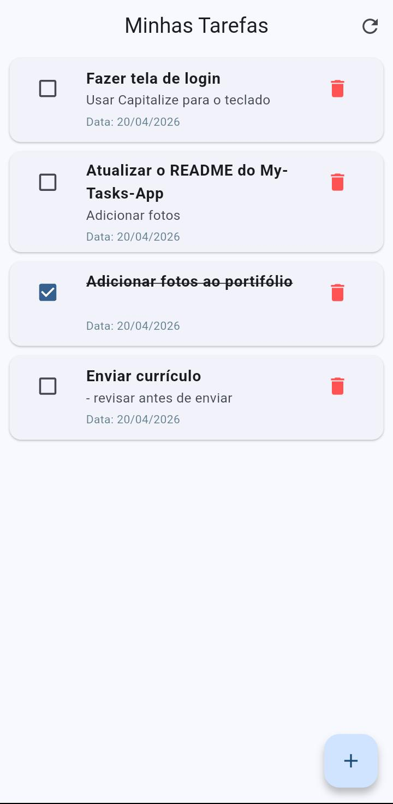
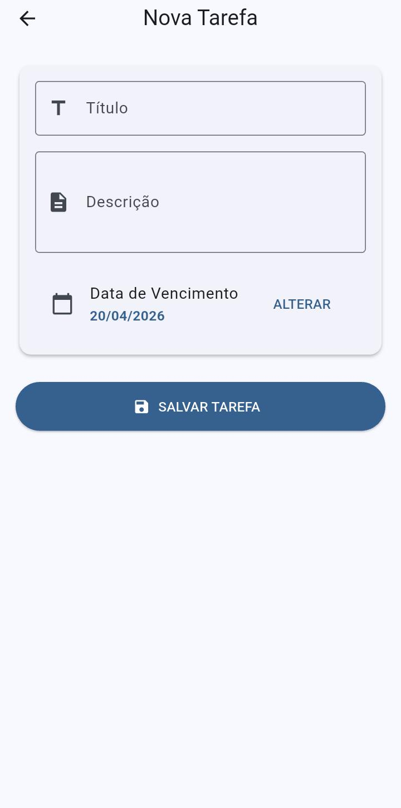
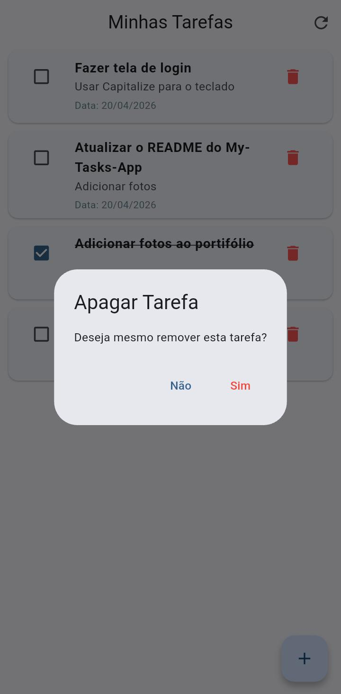

# MyTasks - Aplicativo para Gestão de Tarefas

O MyTasks é um aplicativo pessoal de gestão de tarefas. O projeto foca em uma separação clara de responsabilidades, garantindo segurança via autenticação JWT e uma interface mobile intuitiva e reativa. O projeto foi desenvolvido com o intuito de aprimorar meus conhecimentos em Backend e adquirir novas competências de Frontend e Mobile.

  
  
  

---

### Stack Tecnológica

- Backend: Desenvolvido com Spring Boot, utilizando Spring Security para proteção de dados e Hibernate para mapeamento objeto-relacional;

- Mobile: Interface moderna e performática construída com Flutter;

- Banco de Dados: Armazenamento relacional persistente com MySQL;

- Documentação: API documentada integralmente com Swagger;

---

### Diferenciais

- Segurança: Implementação de autenticação baseada em Tokens JWT e suporte a Soft Deletes para maior controle de dados;

- Containerização: Setup simplificado via Docker e Docker Compose, permitindo que o ambiente de desenvolvimento seja espelhado em produção sem conflitos;

- Deploy: <s> API disponível em <a target="_blank" rel="noopener noreferrer" href="https://my-tasks-api-production-9d51.up.railway.app">Link</a> </s>. O serviço não está mais disponível.

---
